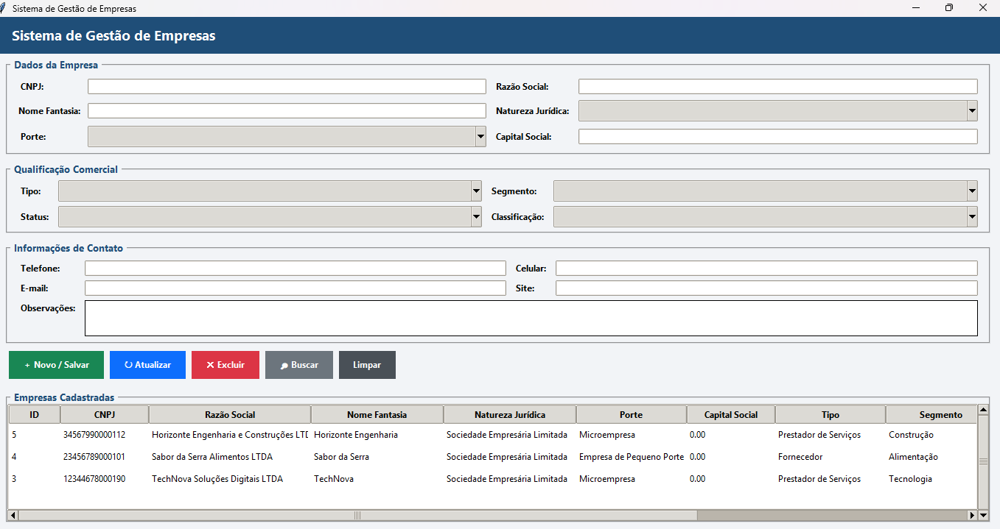

# Sistema de Gestão de Empresas

Sistema desktop desenvolvido em Python para gerenciamento de empresas, utilizando interface gráfica com Tkinter e banco de dados PostgreSQL.

## 🚀 Funcionalidades

- Cadastro de empresas
- Consulta de empresas
- Atualização de dados
- Exclusão de empresas
- Pesquisa por CNPJ
- Pesquisa por Razão Social
- Listagem de empresas em tabela
- Comboboxes integrados ao banco de dados
- Integração com PostgreSQL
- Operações CRUD

## 🛠️ Tecnologias

- Python
- Tkinter
- PostgreSQL
- psycopg2
- python-dotenv
- Git
- GitHub

## 📁 Estrutura

```text
sistema-gestao-empresas/
├── src/
│   ├── main.py
│   ├── tela.py
│   ├── empresasDAO.py
│   └── ...
├── imagens/
│   └── tela.png
├── .gitignore
├── .env.example
├── requirements.txt
└── README.md


## 📸 Screenshots

### Tela principal


```
